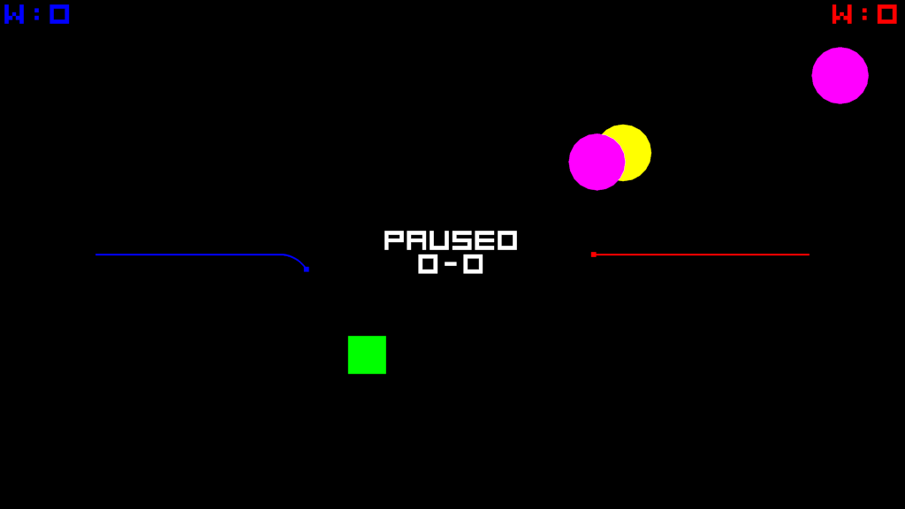

# Lines Plus
 
 
A 2 player (controllers) line game. 
Songgen is interesting on its own. 
Songview I uploaded on accident and can be ignored. Might make a editor for the .song files. 
 
M starts and stops the music.
Survivor gets 3 points. 
Squares are worth 1 point. 
Do not collide with other lines or (yellow) circles with your head. 
Bouncing circles erase lines and another appears every 5 seconds with a short no collision (magenta). 
You are invincible until first move unless you hit the wall on the other side. 
M starts and stops the music. I had a working ai.h. Tell it to prioritize the green square. 
F toggles fullscreen. M starts and stops the music. 
1 and 2 will eventually toggle AI and 2 player. I had a smarter AI that beat a human, but I broke it when it could not beat me. 
Steer with controller triggers. 
You get one 2 second invincibility and invisibility per round by pressing A (X). 
Use this to test your opponent memory and time a trap. 
Beware, they can counter with their own. 
B X Y or circle square triangle pauses during gameplay. 
Q or ESC quits 
Win condition is 50 points for a Set. Modify game.ini for additional options. 
There is a game.ini to modify settings. 
 
Below is the licensing. 
No liability if you use anything here. None of it can be sold commercially by anyone but me. 
How much does it cost? You are not allowed to sell it or distribute commercial products from it. 
 
This license updates and the software and all iterations are covered by the latest version. 
This is not free software. If it is used for commercial use then it requires negotiable royalty (1%+). 
This license covers this software across all iterations, including initial upload. 
Negotiations are with the original orange. The guy typing this out. 
This is not free software and requires royalties for commercial use. 
If this helps you make money on your project, think of me. 
If you make a free project, enjoy. 
Royalties are required for songgen.cpp songgen.h and instruments.h instruments.dat (.dat was previous iterations) 
The other linesplus code is free and cannot be resold. 
Interested parties can find my contact information at https://github.com/ZacGeurts 
 
Why is this not free? Because Lines Plus is 3% of the product. The real meat is the songgen that pretty much makes more songs than grains of sand in the universe. 
All the songs in the universe? No way, that would be crazy. It does not sing like an artist or bang on a cooking pot. 
Somtimes sounds like it. I am making the instruments.h as a side project. 
It is difficult to add new instruments accurately. Many are progressing. 
The generator is under somewhat constant update while I iron out code. 
The goal is to have a generator that is more or less hardcoded for modification rather than the ghost of AI just spitting out music. 
How does it work? ./songgen 
Non-linesplus files - songgen.h - makes structured songs (WIP). songgen.cpp reads .song format and plays using the instruments file. instruments.h intruments.h. 
 TODO: Would benefit greatly with compression (500KB to 50KB per .song)).  
Type `make` to build linesplus and songgen. Needs OpenGL (Mesa)) and SDL2. 
Type `make songgen` if you just want to see songgen build. Needs OpenGL (Mesa) and SDL2. 
Type `make clean` before rebuilding. 
`./linesplus`  
The new songview might cause build issues due to additional dependancies. 
`make linesplus` 
`make songgen` 
Build them seperate (like above) if you experience build issues. 
`make songview` builds, but currently has a broken display. 
If you still have issues try a makefile from before May 19, 2025.
