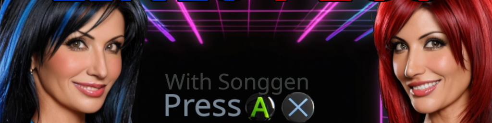

# Lines Plus
 
 
This software is not free for profit. (see below) 
A 2 player (controllers) line game. 
Quickstart: Steer with triggers and press buttons. 
If you have Linux you can grab the zip from the releases on the top right. 
Songgen creates and plays music .song files. 
 
Type `make` to build linesplus and songgen. Needs OpenGL (Mesa) and SDL2. 
`./linesplus` or use icon to play 
`./songgen` from a terminal to use songgen 
`Makefile` has more information if you open it with a text editor. 
 
Type `make songgen` if you just want to use songgen build. 
Type `make clean` before rebuilding. 
 
M starts and stops the music.
Survivor gets 3 points. 
Squares are worth 1 point. 
Do not collide with other lines or (yellow) circles with your head. 
Bouncing circles erase lines and another appears every 5 seconds with a short no collision (magenta). 
You are invincible until first move unless you hit the wall on the other side. 
M starts and stops the music. I had a working ai.h. Tell it to prioritize the green square. 
F toggles fullscreen. M starts and stops the music. 
1 and 2 will eventually toggle AI and 2 player. I had a smarter AI that beat a human, but I broke it when it could not beat me. 
Steer with controller triggers. 
You get one 2 second invincibility and invisibility per round by pressing A (X). 
Use this to test your opponent memory and time a trap. 
Beware, they can counter with their own. 
B X Y or circle square triangle pauses during gameplay. 
ESC quits 
Win condition is 50 points for a Set. Modify game.ini for additional options. 
There is a game.ini file to modify settings. 
 
Below is the licensing. 
No liability if you use anything here. None of it can be sold commercially by anyone but me. 
How much does it cost? You are not allowed to sell it or distribute commercial products from it. 
 
This license updates and the software and all iterations are covered by the latest version. 
This is not free software. If it is used for commercial use then it requires negotiable royalty (1%+). 
This license covers this software across all iterations, including initial upload. 
Negotiations are with the original orange. The guy typing this out. 
This is not free software and requires royalties for commercial use. 
If this helps you make money on your project, think of me. 
If you make a free project, enjoy. 
Royalties are required for songgen.cpp songgen.h and instruments.h instruments.dat (.dat was previous iterations) 
The other linesplus code is free and cannot be resold. 
Interested parties can find my contact information at https://github.com/ZacGeurts 
 
Songgen is the songgen that pretty much makes more songs than grains of sand in the universe. 
All the songs in the universe? No way, that would be crazy. It does not sing like an artist or bang on a cooking pot. 
Somtimes sounds like it. I am making the instruments.h as a side project. 
Space is infinite, matter is not. Music has rules (tempo, beats per minute, etc) and random noise is not music. 
How does it work? `./songgen` from a terminal. 
 
Test your instrment clout in instruments.h. Copy generateViolinWave code block and tell it what you do not like. Somethings like too flat, too wobbly, whatever 
Paste the new code block back in (save) and `make clean` then `make` to have your new instrument ready to hear. 
Change song1.song Instrument: to violin and `./songgen song1.song` to hear it. 
 
If you can make money with it, keep your bro in mind. 
This is not free for commercial use, and if you update my base, it is subject to terms if you try to profit. 
In short, you either pay me or you give it away for free. 
If you give it away free, and someone makes money off it, they have to pay me. 
If you make a free project, then be clear that it is using non free software. 
 
# Songgen files:
songgen.h - makes structured songs 
songgen.cpp - reads .song format and plays using the instruments file 
instruments.h is intruments.h. 
